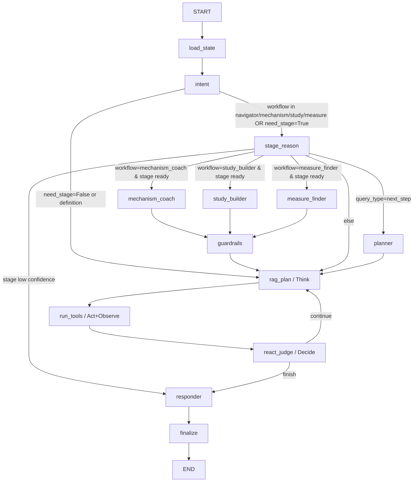

# NIH Stage Model AI Chatbot (Current Architecture)

This project is a **single-endpoint, intent-driven, multi-agent NIH Stage assistant** with four guided workflows.
It uses FastAPI + LangGraph orchestration + local RAG tools + Streamlit frontend.

The design goal is:
- keep user interaction simple (`POST /chat` only),
- keep routing automatic (intent decides workflow and whether to run stage reasoning),
- keep behavior observable (full execution trace returned in debug),
- prevent over-inference on uncertain stage predictions (clarify-only hard gate).

### Guided workflows
- `navigator`: stage inference + stage-aware next steps
- `mechanism_coach`: mechanism ranking + manipulation/verification hints
- `study_builder`: stage-aware design matrix
- `measure_finder`: construct-to-measure shortlist

---

## 1) System Overview

### One entrypoint
- Backend API: `POST /chat`
- Frontend never needs manual API switching.
- All flow decisions happen inside `app/core/orchestrator.py`.

### Core runtime path

`User -> /chat -> Orchestrator(LangGraph) -> Think/Plan -> Act(Tools) -> Observe -> Judge -> Final Reply + Debug Trace`

### High-level flow
1. Load/create session state.
2. Run `intent_agent` on every turn.
3. Route by intent:
   - `navigator` stage path: `stage_agent` -> optional `planner_agent`
   - `mechanism_coach` path: `stage_agent` -> `mechanism_coach_agent`
   - `study_builder` path: `stage_agent` -> `study_builder_agent`
   - `measure_finder` path: `stage_agent` -> `measure_finder_agent`
   - direct path: skip stage reasoning/workflow agents
4. Enter structured ReAct loop:
   - `rag_agent` (Think/Plan tool actions)
   - `run_tools` (Act + Observe)
   - `react_judge` (Decide continue vs stop)
5. Final response:
   - `clarify_only_gate` if stage is uncertain
   - otherwise `responder_agent`
6. Save state and return reply + debug info.

---

## 2) Repository Structure

```text
app/
  main.py                     # FastAPI entrypoint
  config.py                   # env-based settings
  logging_config.py
  agents/
    base.py
    intent_agent.py
    stage_agent.py
    planner_agent.py
    rag_agent.py
    responder_agent.py
  core/
    orchestrator.py           # LangGraph runtime + routing + hard gates
    types.py                  # Pydantic contracts
    state_store.py            # in-memory session store
    memory.py                 # short-term + summary context
    llm.py                    # unified LLM client wrapper
    guardrails.py             # input/output validation & sanitization
  prompts/
    intent.md
    stage.md                  # Stage reasoning prompt (kept in reasoning chain)
    planner.md
    responder.md
  tools/
    __init__.py               # tool registry wiring
    base.py                   # BaseTool + ToolRegistry
    db_tool.py
    vector_tool.py
    versioned_rag_tool.py
    vector_store.py           # TF-IDF store implementation
    document_loader.py        # PDF/DOC/DOCX loader + chunking
frontend_streamlit.py         # chat UI + debug/thinking trace
load_documents.py             # ingest docs into vector store
requirements.txt
```

---

## 3) Detailed Component Map

## API Layer

### `app/main.py`
- Creates FastAPI app and CORS middleware.
- Instantiates `Orchestrator`.
- Injects shared `tool_registry`.
- Endpoints:
  - `GET /` basic metadata + available tools
  - `GET /health` health check
  - `POST /chat` main chat endpoint
  - `GET /sessions/{session_id}` debug state inspector
- Applies guardrails:
  - validates input message,
  - sanitizes final text response.

## Orchestration Layer

### `app/core/orchestrator.py`
- Uses LangGraph `StateGraph` with a structured ReAct control loop.
- Nodes:
  - `load_state`
  - `intent`
  - `stage_reason`
  - `planner`
  - `mechanism_coach`
  - `study_builder`
  - `measure_finder`
  - `guardrails`
  - `rag_plan`
  - `run_tools`
  - `react_judge`
  - `responder`
  - `finalize`
- Conditional routes:
  - `intent` -> `stage_reason` or `rag_plan`
  - `stage_reason` -> `planner` or workflow node or `rag_plan` or `responder`
  - workflow node -> `guardrails` -> `rag_plan`
  - `react_judge` -> `rag_plan` (continue) or `responder` (stop)
- Stores turn-level `execution_trace` in debug payload.
- Contains robust bool parser `_as_bool()` for noisy LLM outputs.

### Hard safety/control logic (important)
- In stage flow, if:
  - `stage_result is None` OR
  - `stage_confidence < 0.75`
- then **`clarify_only_gate` is triggered**:
  - responder free generation is skipped,
  - system outputs clarify request and missing key fields,
  - route mode becomes `stage_clarify`.
- This prevents responder from over-guessing a stage.

## Agent Layer

### `app/agents/base.py`
- Shared abstract interface:
  - `run(state, user_message, context) -> AgentOutput`
  - `update_state(state, output) -> None`

### `app/agents/intent_agent.py`
- First agent called every turn.
- Extracts structured intent signals:
  - `intent_label`
  - `query_type`
  - `need_stage`
  - language and missing info hints (when available)
- Includes consistency correction so stage-type queries map to `need_stage=True` (except definition queries).

### `app/agents/stage_agent.py`
- Performs NIH Stage reasoning.
- Uses `app/prompts/stage.md` as primary prompt source.
- Outputs:
  - `stage` (Roman numerals where applicable)
  - `confidence`
  - `reasoning_summary`
  - `missing_info` / `miss_info`
  - `clarifying_question`
- Fallback rules exist if LLM output is incomplete.

### `app/agents/planner_agent.py`
- Generates next-step plan details for `next_step` style requests.
- Can provide:
  - response outline
  - next user question
  - optional tool actions

### `app/agents/rag_agent.py`
- Decides retrieval strategy and emits tool calls.
- Main retrieval action uses `versioned_rag_tool`.
- Supports definition/general and stage-related queries.

### `app/agents/responder_agent.py`
- Produces final natural-language response when clarify gate is not active.
- Consumes prior structured results (intent/stage/planner/tool artifacts).
- Supports evidence-grounded answering and source/citation inclusion.

## Memory + State Layer

### `app/core/types.py`
- Pydantic contracts for:
  - chat messages (`Message`, `MessageRole`)
  - per-session state (`SessionState`)
  - slots (`StageSlots`)
  - tool output (`Artifact`, `Citation`, `ToolResult`)
  - agent output (`AgentOutput`, `ToolCall`)
  - API schemas (`ChatRequest`, `ChatResponse`)

### `app/core/state_store.py`
- In-memory state store keyed by `session_id`.
- Handles create/get/save/delete/list of sessions.
- Easy to replace with Redis/DB in production.

### `app/core/memory.py`
- Builds agent context from:
  - short-term recent messages,
  - current slots,
  - optional conversation summary.
- Controls summary trigger threshold and context window.

### `app/core/guardrails.py`
- Input validation (length + basic forbidden pattern checks).
- Output sanitation (max response length cap).

## LLM Layer

### `app/core/llm.py`
- Unified LLM access layer for agents.
- Supports configured provider/model via `app/config.py`.
- Current defaults:
  - provider: `ollama`
  - model: `qwen2.5:3b-instruct`

## Tooling / Retrieval Layer

### `app/tools/__init__.py`
- Creates shared `SimpleVectorStore`.
- Registers tools into global `tool_registry`:
  - `DBTool`
  - `VectorTool`
  - `VersionedRAGTool`

### `app/tools/base.py`
- `BaseTool` abstraction.
- `ToolRegistry` for registration + dispatch.
- Converts `ToolResult` into `Artifact`.

### `app/tools/versioned_rag_tool.py`
- Version-aware retrieval:
  - semantic relevance
  - recency signals
  - revision/version hints in filenames/metadata
- Used to prioritize newer/revised docs for same-topic queries.

### `app/tools/vector_tool.py`
- Generic vector retrieval wrapper over local store.

### `app/tools/db_tool.py`
- Structured lookup helper (including stage definition support).

### `app/tools/vector_store.py`
- Local TF-IDF storage/index/search backend.

### `app/tools/document_loader.py`
- Loads/splits PDF, DOC, DOCX into retrieval chunks.

### `load_documents.py`
- Offline ingestion script:
  - read docs from `data/documents`
  - chunk + index into `data/vector_store`

## Prompt Layer

### `app/prompts/intent.md`
- Intent extraction prompt template.

### `app/prompts/stage.md`
- Stage reasoning template.
- Integrated directly into `StageAgent` reasoning call chain.

### `app/prompts/planner.md`
- Planning output guidance.

### `app/prompts/responder.md`
- Final response generation guidance.

## Frontend Layer

### `frontend_streamlit.py`
- Chat UI with session controls.
- Backend health indicator.
- Debug mode view (`debug` JSON).
- Thinking trace panel:
  - route mode / route notes
  - agent calls with analysis/confidence
  - tool calls + sources
  - gate steps (including `clarify_only_gate`)

---

## 4) LangGraph Call Graph



## 5) Runtime Decision Rules

### After `intent_agent`
- If workflow is `mechanism_coach` / `study_builder` / `measure_finder` -> always enter stage prelude.
- Else if `intent_need_stage == True` -> stage flow.
- Else if definition query -> direct/rag flow.
- Else -> direct/rag flow.

### After `stage_agent`
- If stage is unresolved (`null` or low confidence) -> clarify first, stop workflow execution.
- If workflow is `mechanism_coach` -> run `mechanism_coach_agent`.
- If workflow is `study_builder` -> run `study_builder_agent`.
- If workflow is `measure_finder` -> run `measure_finder_agent`.
- If `intent_query_type == next_step` -> run `planner_agent`.
- Else -> go directly to `rag_agent`.

### ReAct loop (`rag_plan` -> `run_tools` -> `react_judge`)
- Continue loop when evidence is still insufficient and step budget remains.
- Stop loop when:
  - evidence is collected,
  - no tool is needed,
  - max steps reached,
  - or stage uncertainty requires clarify-only response.

### In `responder` node
- If stage flow and stage uncertain (`null` or low confidence) -> `stage_clarify` hard gate.
- Else -> normal responder generation (`stage_answer` or `direct_reply`).

---

## 6) API Contract

### `POST /chat`

Request:

```json
{
  "session_id": "optional-session-id",
  "message": "We ran a pilot RCT with N=40. Which NIH stage is this?"
}
```

Response (shape):

```json
{
  "session_id": "optional-session-id-or-default",
  "reply": "assistant response",
  "debug": {
    "orchestration_engine": "langgraph",
    "route_mode": "direct_reply | stage_flow | stage_answer | stage_clarify",
    "route_notes": "routing notes",
    "agents_called": ["intent_agent", "stage_agent", "rag_agent", "responder_agent"],
    "stage": "I | II | ... | null",
    "stage_confidence": 0.0,
    "need_stage": true,
    "tools_called": 1,
    "execution_trace": [
      {"kind": "agent", "name": "intent_agent"},
      {"kind": "tool", "name": "versioned_rag_tool"},
      {"kind": "gate", "name": "clarify_only_gate"}
    ]
  },
  "citations": [],
  "next_question": null
}
```

---

## 7) Configuration

Configured in `app/config.py` (env-compatible):
- `DEBUG`
- `LLM_PROVIDER`
- `LLM_MODEL`
- `LLM_TIMEOUT_SECONDS`
- `OLLAMA_BASE_URL`
- `VECTOR_STORE_PATH`
- `DOCUMENTS_DIR`

Default local model stack:
- Ollama
- `qwen2.5:3b-instruct`

---

## 8) Local Run

### 1. Install dependencies

```bash
python -m venv venv
source venv/bin/activate
pip install -r requirements.txt
```

### 2. (Recommended) Index documents for RAG

```bash
python load_documents.py
```

### 3. Start backend

```bash
uvicorn app.main:app --reload --host 0.0.0.0 --port 8000
```

### 4. Start frontend

```bash
streamlit run frontend_streamlit.py
```

---

## 9) Quick Verification

### Health check

```bash
curl http://127.0.0.1:8000/health
```

### Chat request

```bash
curl -X POST "http://127.0.0.1:8000/chat" \
  -H "Content-Type: application/json" \
  -d '{
    "session_id": "demo",
    "message": "How many stages are in the NIH Stage Model?"
  }'
```

### Stage-uncertain test (should trigger clarify gate)
Ask a vague stage question with missing design details and inspect:
- `debug.route_mode == "stage_clarify"`
- `execution_trace` contains `clarify_only_gate`

---

## 10) Known Scope / Current Limits

- `state_store` is in-memory only (no persistence across server restarts).
- summary memory is lightweight and can be upgraded with LLM summarization policy.
- guardrails are basic and should be expanded for production safety requirements.
- vector retrieval is local TF-IDF; can be replaced by Pinecone/FAISS/etc.

---

## License

MIT
