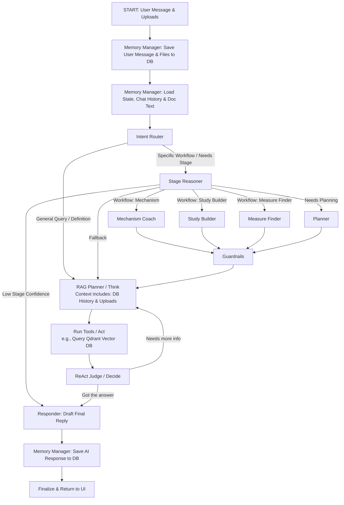

# NIH Stage Model AI Chatbot (Local Dev + Docker Deployment)

This version uses an OpenAI-compatible inference endpoint (recommended: vLLM).  
Unified backend entrypoint: `POST /chat`.

---

---

## 1) Local Development (Recommended for your current setup)

Best for Mac or no-GPU environments: run FastAPI locally and point it to your inference endpoint (local or remote).

### 1.1 Prepare Environment

```bash
python3 -m venv venv
source venv/bin/activate
pip install -r requirements.txt
```

### 1.2 Configure `.env`

```bash
cp .env.local.example .env
```

Key fields in `.env`:

```env
VLLM_BASE_URL=http://127.0.0.1:8001/v1
LLM_MODEL=my-inference-model
```

Notes:
- `VLLM_BASE_URL`: inference endpoint URL (OpenAI-compatible)
- `LLM_MODEL`: model ID exposed by your inference service
- If auth is required, set `LLM_API_KEY`
- To enable Redis-backed persistent session memory:
  - `REDIS_URL=redis://127.0.0.1:6379/0`
  - `STATE_TTL_SECONDS=604800`
  - `REDIS_KEY_PREFIX=nih_chatbot`
- Hybrid memory tuning parameters:
  - `SHORT_TERM_LIMIT=20`
  - `SUMMARY_THRESHOLD=10`
  - `SUMMARY_REFRESH_EVERY_TURNS=6`
  - `LONG_TERM_MEMORY_WINDOW=50`
  - `LONG_TERM_MEMORY_MAX_LINES=8`
  - `MEMORY_CONTEXT_MAX_CHARS=6000`

### 1.3 Start FastAPI

```bash
./run_local_dev.sh
```

Or directly:

```bash
uvicorn app.main:app --host 0.0.0.0 --port 8000 --reload
```

### 1.4 Verify

```bash
curl http://127.0.0.1:8000/health
```

```bash
curl -X POST "http://127.0.0.1:8000/chat" \
  -H "Content-Type: application/json" \
  -d '{
    "session_id": "demo",
    "message": "Please explain NIH Stage Model stage definitions."
  }'
```

---

## 2) GPU Server Docker Deployment (Optional)

Use this mode when packaging your fine-tuned local weights for external service usage.

### 2.1 Machine Requirements

- Linux + NVIDIA GPU
- Docker + Docker Compose
- NVIDIA Driver + nvidia-container-toolkit

### 2.2 Prepare `.env`

```bash
cp .env.vllm.example .env
```

Common local-weight setup:

```env
LOCAL_MODEL_DIR=/opt/models
VLLM_MODEL=/models/my-ft-model
VLLM_SERVED_MODEL_NAME=my-ft-model
```

### 2.3 Start

```bash
./run_vllm_local.sh
```

Or:

```bash
docker compose --env-file .env -f docker-compose.vllm.yml up -d --build
```

### 2.4 Verify

```bash
curl http://127.0.0.1:8001/v1/models
curl http://127.0.0.1:8000/health
```

---

## 3) Common Issues

- No local GPU: use section 1 (local API + external inference service)
- Timeout: increase `LLM_TIMEOUT_SECONDS`
- `404 /v1/chat/completions`: verify the inference service is truly OpenAI-compatible
- Model not found: verify `LLM_MODEL` matches the model ID exposed by the endpoint
